# Práctica de comandos de Git
#### Libre configuración - Guillermo Bárcenas López, Francisco Mejías de Matos, Mario Alcaide Perez y Felipe Alonso Fernandez  

---
Esta pratica tiene como fin poder aplicar Git a nuestros proyectos, practicaremos los comandos básicos como add, commit, push y algunos mas avanzados como Merge 

---
##### Índice
- **Creación de una rama** 
- **Commit Inicial** 
- **Conflicto entre la web y local** 
- **Uso de Merge** 
- **Uso de Stash y Amend** 
- **Uso de Revert** 
- **Uso de Cherry Pick** 
- **Creación de Pull-Request** 
- **Listado y borrado de Ramas** 
- **Conclusiones**
---
1. **Creación de una rama**  
Partimos de un repositorio público que hemos compartido todos los integrantes del grupo para poder operar sobre él. En el primer paso cada integrante deberá clonar el repositorio usando este comando.  
   ~~~
   git clone https://github.com/guillermo20052009/ProyectoLibreConfiguracion
   ~~~
   Tras clonar el repositorio cada integrante del grupo creará un rama con el siguiente formato <nombre_apellidos_v1> para trabajar sobre ella.  
   ~~~
   git checkout -b <nombre_apellidos_v1>
   ~~~
   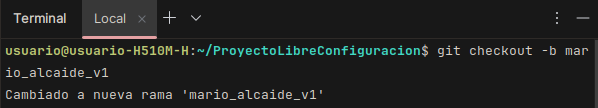  
---
2. **Commit inicial** 
Para inicializar la rama en GitHub, haremos un push diferente al habitual ya que tendremos que crear también la rama en el repositorio remoto.
Push para inicializar la rama en el repositorio remoto: 
   ~~~
   git push --set-upstream origin <nombre_apellidos_v1>
   ~~~
     

   Push habitual: 
   ~~~
   git push
   ~~~
   Por lo tanto los pasos a seguir ahora mismo son: 
   ~~~
   git add .
   git commit -m "Add used commands"
   git push --set-upstream origin <nombre_apellidos_v1>
   ~~~
   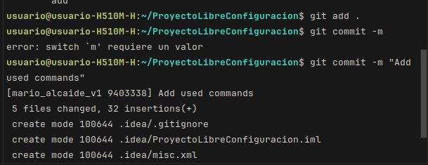  
---
3. **Provocando un conflicto** 
Vamos a cambiar el fichero command_history en la web, por la linea que queramos y guardamos el commit con un mensaje indicando que lo hemos guardado desde la Web.
     

   Acto seguido, en local vamos a poner una linea diferente en el mismo fichero y subiremos los cambios a github con un push.
   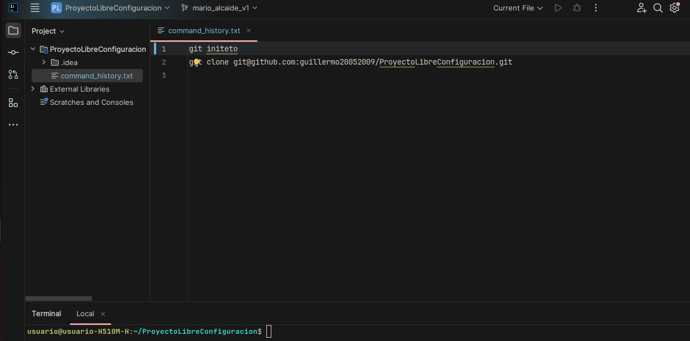  
   
   Esto nos va resultar en un error ya que la rama no esta actualizada, debemos hacer en primer lugar un Pull.
   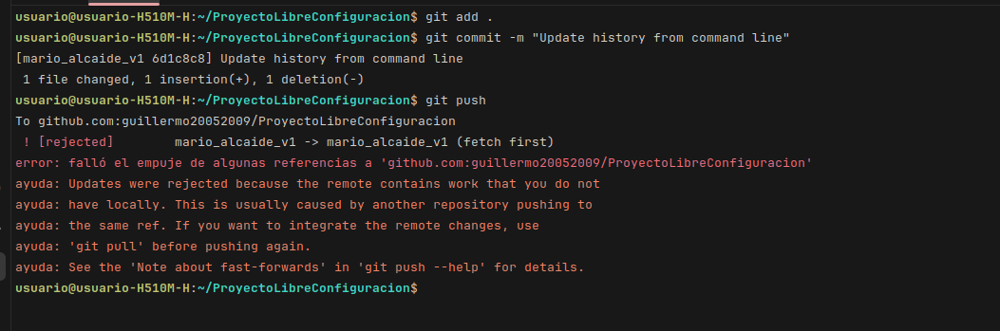  

   Si no hemos configurado antes lo que debe hacer commit con los conflictos, nos dará un error que lo arreglaremos con la siguiente línea:
   ~~~
   git config pull.rebase false
   ~~~
   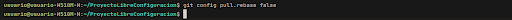  

   Luego de poner esto el pull funcionará correctamente:
   ~~~
   git pull origin <nombre_apellidos_v1>
   ~~~
   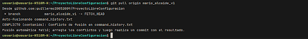  

   Luego haremos el push y nos debe funcionar correctamente
   ~~~
   git add .
   git commit -m "Solve conflicts"
   git push
   ~~~
   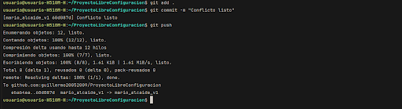  
---
4. **Merge Entre Ramas** 
Vamos a crear una nueva rama:
   ~~~
   git checkout -b <nombre_apellidos_v2>
   ~~~
   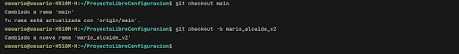  
   Una vez creada volveremos a la rama v1 y crearemos command_history2.txt, al que añadiremos un par de líneas simbólicas.
   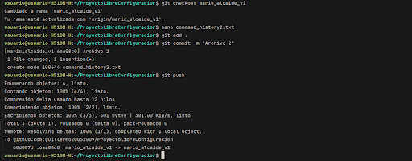  
   Ahora volveremos a la rama v2 y haremos el merge:
   ~~~
   git merge `<nombre_apellidos_v1>` -m "Merge v1"
   ~~~
   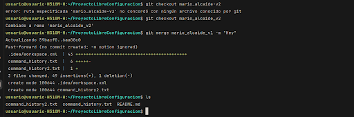  
   Ahora si queremos comprobarlo, en esta rama nos saldrá tambien el archivo command_history2.txt aunque lo hayamos creado en otra rama. En este caso no hace falta hacer un commit porque Merge lo hace automáticamente, solo haremos el push:
   ~~~
   git push --set-upstream origin <nombre_apellidos_v2>
   ~~~
   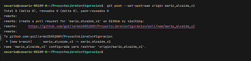  
   Si hacemos git log podemos ver en la rama 2 los mismos commits que en la rama 1:
   ~~~
   git log
   ~~~
   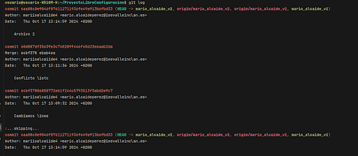  
---
5. **Stash y amend** 
Cambiaremos a la rama uno y añadiremos una línea en el archivo command_history.txt
Si ponemos git status podemos comprobar que tenemos cambios sin guardar:
   ~~~
   git status
   ~~~
   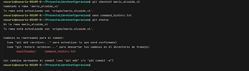  
   Haremos un git stash, esta funcion nos va a permitir guardar los cambios en una stash list lo cual es muy útil si no queremos realizar todavía el commit pero si cambiar de rama:
   ~~~
   git stash
   ~~~
   para listar los stash actuales haremos stash list:
   ~~~
   git stash list
   ~~~
   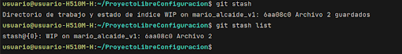  
   Por último para restaurar esos cambios y poder realizar el commit usaremos:
   ~~~
   git stash apply "stash@{0}"
   ~~~
   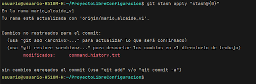  
   Ahora subiremos los cambios de manera normal:
   ~~~
   git add .
   git commit -m "Add text"
   git push
   ~~~
   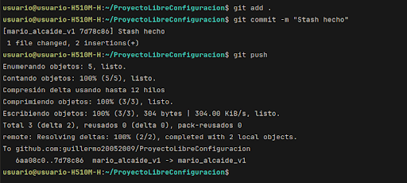  
   Ahora vamos a usar amend para cambiar el mensaje del último commit:
   ~~~
   git commit --amend -m "Add text to revert"
   ~~~
   Para subirlo le añadiremos a push la opcion -f que es para forzarlo:
   ~~~
   git push -f
   ~~~
   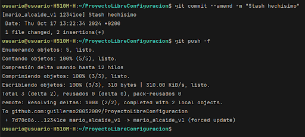  
---
6. **Revert** 
Para revertir un commit necesitamos visualizar el historial de commits realizados y copiar el id del que queramos restaurar, nosotros vamos a coger el ultimo:
   ~~~
   git log
   ~~~
   Ahora realizaremos el revert, tras ejecutarlo se nos abrirá un editro donde podemos cambiar el mensaje del commit, si no hemos cambiado nada pondremos :q y si queremos guardar los cambios :wq
   ~~~
   git revert <id>
   git push
   ~~~
   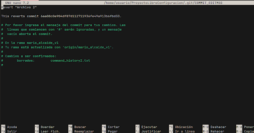  
   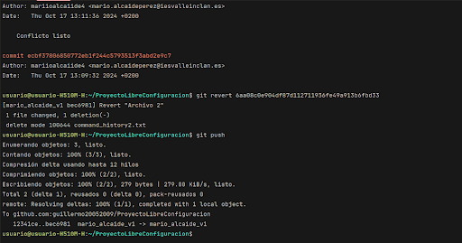  
---
7. **Cherry Pick** 
Vamos a crear una nueva rama:
   ~~~
   git checkout main
   git checkout -b <nombre_apellidos_v3>
   ~~~
   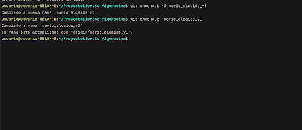  
   Ahora nos iremos a la rama v1, haremos un git log y copiaremos el id del commit que queramos copiar:
   ~~~
   git log
   ~~~
   Volveremos a cambiar a la rama v3 y haremos el cherry-pick, para copiar el commit de la rama 1:
   ~~~
   git cherry-pick <id>
   ~~~
   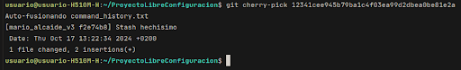  
   Por útlimo subiremos los cambios al repositorio remoto:
   ~~~
   git add .
   git commit -m "Additional changes in v3"
   git push --set-upstream origin <nombre_apellidos_v3>
   ~~~
     
---
8. **Pull-request** 
Desde la web de github hacemos un pull request para volcar la rama v1 en v2. le damos a contribute y Open pull request

   Una vez dentro le ponemos de nombre V2 y arriba a la izquierda configuramos las ramas.
   
   Tras esto aceptamos Merge pull request y ya lo tendríamos hecho
   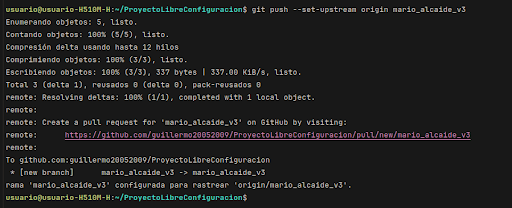  

---
9. **Listado y borrado de ramas** 
Vamos a listar las ramas para saber el nombre y borrarlas:
   ~~~
   git branch
   ~~~
   Si queremos borrar las ramas v2 y v3, no podemos estar situados en ellas, así  que nos iremos a la rama v1 y desde ahí borraremos las demás:
   ~~~
   git checkout v1
   git branch -d <nombre_apellidos_v2>
   git push origin --delete <nombre_apellidos_v2>
   git branch -d <nombre_apellidos_v3>
   git push origin --delete <nombre_apellidos_v3>
   ~~~

[Enlace al diagrama](https://drive.google.com/file/d/1OGA-V4_20N8UnIGlXNveywVdCZCEsaSm/view?usp=sharing) 
